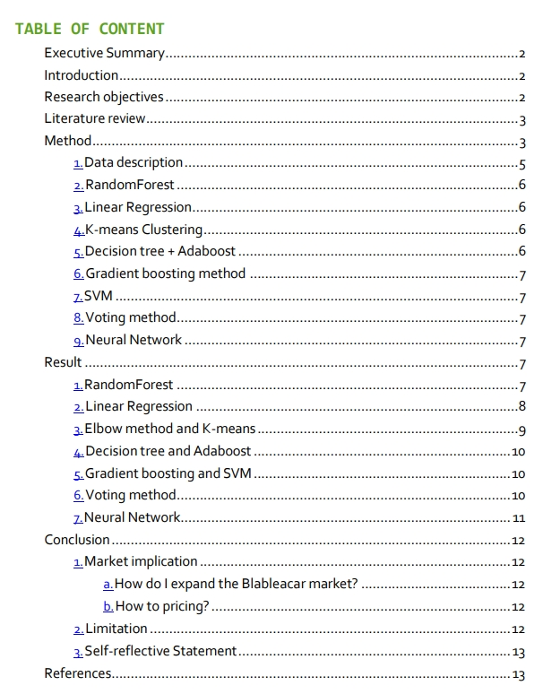

# Blablacar_Analysis
This report is aiming at using different machine learning skills and algorithms on Blabla car real-world data to do a data-driven marketing analysis.
In this report, `Random Forest`, `Decision Tree`, `Adaboost`, `SVM`, `Voting method` and `Neural network` have been used for pricing model.
Besides, `k-means method` and `linear regression` were applied for market analysis and causal inference.

The full content of report please check [Blabla_car_marketing_and_pricing_analysis.pdf](https://github.com/YH-Chen1225/Blablacar_Analysis/files/9974531/Blabla_car_marketing_and_pricing_analysis.pdf)
This report was done by MosesChen on 2019.
The original data description please check here.[Data_description.xlsx](https://github.com/YH-Chen1225/Blablacar_Analysis/files/9974557/Data_description.xlsx)
